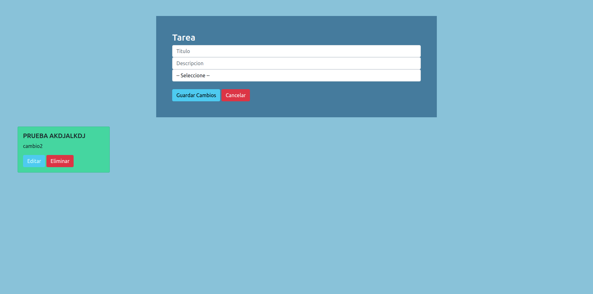

# todolist
<h1 align="center">DJANGO 2  - AngularJS  TODOLIST</h1>

  
   
  <i>Proyecto de lista de tareas
      utilizando mysql, angularjs y django2</i>
   

### Prerequisites

- Tener instalado python3.6

## Instalación

- Debe crear su entorno virtual con python 3.6

- Intalar el requirements.txt

- Para iniciar el proyecto primero debe crear la base de datos con nombre todolist
y hacer la importación del archivo todolist.sql

- Entrar en el proyecto y ejecutar python manage createsuperuser, para tener un super usuario inicial

- Ejecutar python manage check , para revisar que todo este en orden

- Ejecutar python manage runserver

### Quieres ayudar?

Si deseas mejorar el codigo, puedes escribirme a adridan1992@gmail.com
